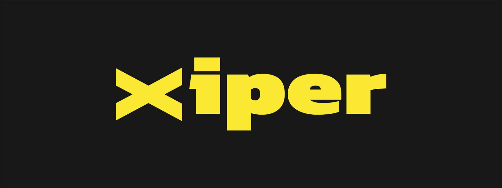

# xipher

[![npm version][npm-version-src]][npm-version-href]
[![npm downloads][npm-downloads-src]][npm-downloads-href]
[![bundle][bundle-src]][bundle-href]
[![License][license-src]][license-href]

xipher is a simple wrapper around the subtle crypto API.

  

## Security Considerations

You have read this section already pretty much everywhere.

Security is not a thing that is either there or not, it's a process.

  

Ultimately, there is no algorithm to determine whether an encryption is secure, there is just a bunch of very smart folks trying to break it.
Sure some pattern of attack emerges, but still, there is no life-equation that determines whether a algorithm is secure or not.
As you might have already guess, if there is no algorithm to determine whether an encryption standard is secure, there is no algorithm to determine whether your specific implementation is secure.

  

So here's the rule, the word "secure" have no meaning, secure from what? secure when? secure how?
Whiteout addressing those questions, the word "secure" is just a buzzword.

Ok then, what should you do?

This library uses the Web Crypto API, which is a well-tested and secure API.
Certain functionality are just wrappers around that API, others are implemented by gluing together those functionalities.

## License

[MIT](./LICENSE)

[npm-version-src]: https://img.shields.io/npm/v/xipher?style=flat&colorA=1c1c1c&colorB=dead38
[npm-version-href]: https://npmjs.com/package/xipher
[npm-downloads-src]: https://img.shields.io/npm/dm/xipher?style=flat&colorA=1c1c1c&colorB=dead38
[npm-downloads-href]: https://npmjs.com/package/xipher
[bundle-src]: https://img.shields.io/bundlephobia/minzip/xipher?style=flat&colorA=1c1c1c&colorB=dead38
[bundle-href]: https://bundlephobia.com/result?p=xipher
[license-src]: https://img.shields.io/github/license/lucacicada/xipher.svg?style=flat&colorA=1c1c1c&colorB=dead38
[license-href]: https://github.com/lucacicada/xipher/blob/main/LICENSE
